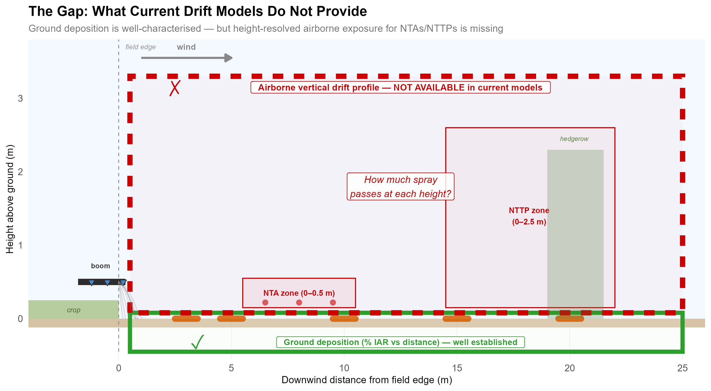
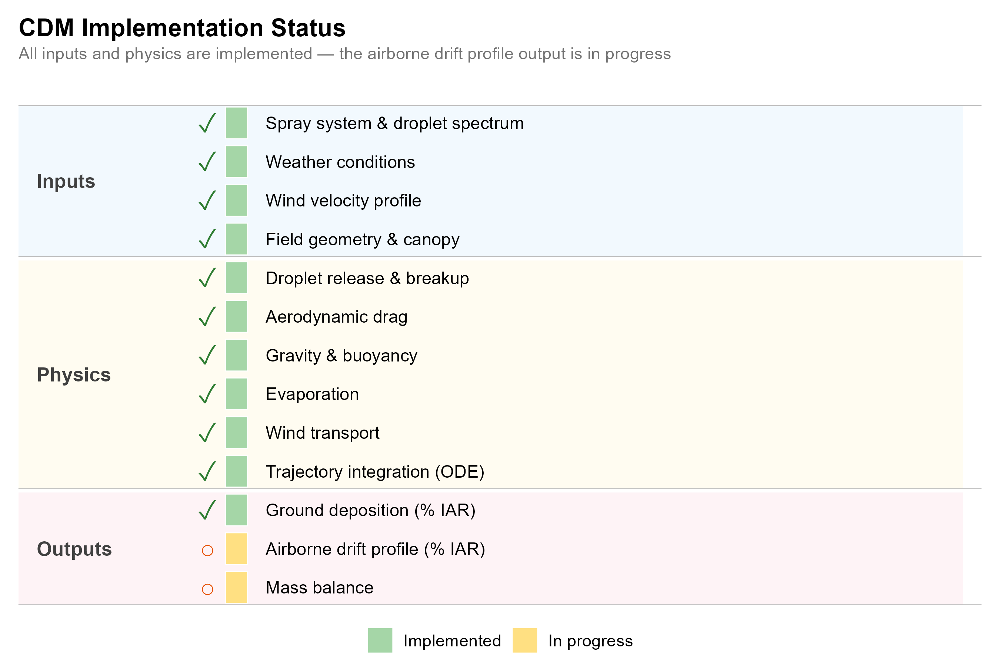

## Implementation Flow

```{mermaid}
%%| fig-width: 10
flowchart TD
    subgraph INPUT["User Input Configuration"]
        A1["Standard Casanova Inputs<br/>(nozzle, meteo, droplet spectrum)"]
        A2["<b>Optional:</b> verticalProfile = TRUE<br/>distances: [5, 10, 20] m<br/>heightBins: [0, 0.25, 0.5, ..., 5.0] m"]
    end

    subgraph CORE["Numerical ODE Solver (CVODE / SUNDIALS [4])"]
        B1["Droplet trajectory<br/>ordinary differential equation (ODE) solver<br/>State: (Z, X, Vz, Vx, Mw, Vwx)"]
        B2["For each droplet size × streamline:<br/>Solve drag + evaporation + wind"]
        B3["Root-finding events:<br/>g0: Z=ground → deposition<br/>g1–gN: X=distance → record (z, mw)"]
    end

    subgraph ACCUM["Vertical Profile Accumulator"]
        C1["Collect in-flight crossings<br/>at each target distance"]
        C2["Bin by height intervals<br/>Weight by residual droplet mass"]
        C3["Normalise → fraction of applied rate<br/>per height bin"]
    end

    subgraph OUTPUT["Model Outputs (both in % IAR)"]
        direction LR
        subgraph GROUND["Ground Deposition"]
            D1["% IAR deposited on ground<br/>at each downwind distance"]
            D1a["Geometry: horizontal surface"]
            D1b["Use: aquatic & soil risk"]
        end
        subgraph VERTICAL["Vertical Drift Profile ⟨optional⟩"]
            D2["% IAR passing through air<br/>per height bin at each distance"]
            D2a["Geometry: vertical cross-section"]
            D2b["Use: NTA/NTTP risk"]
        end
    end

    subgraph USE["Downstream Application"]
        E1["Aquatic Risk Assessment<br/>(what lands on water)"]
        E2["NTA/NTTP Risk Assessment<br/>(what flies past at canopy height)"]
    end

    INPUT --> CORE
    B1 --> B2 --> B3
    CORE --> ACCUM
    C1 --> C2 --> C3
    ACCUM --> OUTPUT
    D1 ==>|always| E1
    D2 ==>|primary for NTA| E2
```

## Ground Deposition vs. Vertical Profile

Both outputs are expressed in **% IAR** (Percent of Initial Application Rate, as defined in ISO 22866 [1]) but answer different questions:

| | Ground Deposition | Vertical Drift Profile |
|--|---|---|
| **Measures** | Mass deposited **on the ground** at distance *d* | Mass **passing through the air** at distance *d*, height *h* |
| **Geometry** | Horizontal surface (ground collector) | Vertical plane (cross-section in air) |
| **Risk domain** | Aquatic / soil organisms | Non-target plants & arthropods (NTA/NTTP) |
| **Why it matters** | Drift into water bodies | Drift onto elevated organisms (hedgerows, canopy) |

::: {.callout-note}
**Key relationship:** Total airborne drift at distance *d* (sum of all vertical bins) = Applied − cumulative ground deposition from 0 to *d*.
:::

<!-- ...existing code... -->
## Implementation Steps

| Step | Description | Notes |
|------|-------------|-------|
| 1 | Add `verticalProfile` flag + config to input JSON (JavaScript Object Notation) | Distances, height bins, enable/disable |
| 2 | Register additional root functions `g1..gN` for each target distance | Triggered when X(t) = d_i |
| 3 | At each root event, record (z, mw, droplet_class, streamline) | Raw crossing data |
| 4 | After integration, bin crossings by height | Weight by mass fraction of applied |
| 5 | Normalise to produce **% IAR** per bin | Sum across sizes and streamlines |
| 6 | Output as `"verticalDriftProfile"` in JSON | Optional section |

## Design Decisions & Suggestions

- **Optional output** — no overhead when disabled (no extra roots registered)
- **% IAR is the primary metric** — directly feeds exposure/risk calculations
- **Intermediate outputs** available for diagnostics (per-size, cumulative, evaporation state)
- **Default distances**: align with regulatory standards (3, 5, 10, 20 m)
- **Cumulative % IAR from ground up**: useful for "fraction below canopy height *h*"
- **Validation**: compare against SETAC DRAW (Drift and Risk Assessment Working group) vertical collector data [2]


## The Gap in Current Drift Assessment

{#fig-gap width="100%"}

---

## Implementation Status

Mapping the physical process diagram to the CDM codebase reveals that all inputs and physics are fully implemented — the missing piece is the **vertical profile output chain**: root-finding at target distances, crossing recording, height binning, and JSON serialization.

{#fig-impl-status width="100%"}

---

## Visualizations

Realistic parameterization based on:

- **Droplet spectrum:** ASABE (American Society of Agricultural and Biological Engineers) medium spray quality [5], VMD (Volume Median Diameter) ~236 µm, Rosin-Rammler droplet size distribution
- **Application:** Nozzle height 0.5 m, fan angle 110°, 11 streamlines
- **Meteorology:** Wind 3 m/s, T 20 °C, RH 60%
- **Ground deposition:** Rautmann regression [3] (arable, medium spray quality)
- **Vertical profiles:** Gamma-distributed height concentration; total airborne from mass balance

---

## 1. Measurement Geometry Schematic

```{r}
#| label: fig-geometry
#| fig-cap: "Side-view schematic of spray drift measurement. Orange bars = ground collectors measuring horizontal deposition. Blue plane = vertical cross-section measuring airborne drift profile by height."
#| fig-width: 10
#| fig-height: 5.5

library(ggplot2)
library(dplyr)

boom_z <- 0.5
vp_distance <- 10

# Realistic droplet trajectories (simplified ballistic + drag + wind)
make_traj <- function(v0_z, v0_x, drag_coeff, n = 80) {
  dt <- 0.05
  x <- y <- numeric(n)
  vx <- v0_x; vy <- v0_z
  x[1] <- 0; y[1] <- boom_z
  wind <- 3.0; g <- 9.81
  for (i in 2:n) {
    vx <- vx + (wind - vx) * drag_coeff * dt
    vy <- vy - g * dt * (1 - drag_coeff * 0.3)
    x[i] <- x[i-1] + vx * dt
    y[i] <- y[i-1] + vy * dt
    if (y[i] < 0) { y[i] <- 0; break }
  }
  data.frame(x = x[1:i], y = y[1:i])
}

trajs <- bind_rows(
  make_traj(-2.0, 1.0, 0.05) |> mutate(size_class = "large (>300 µm)", traj_id = 1),
  make_traj(-1.5, 1.5, 0.06) |> mutate(size_class = "large (>300 µm)", traj_id = 2),
  make_traj(-2.5, 0.8, 0.04) |> mutate(size_class = "large (>300 µm)", traj_id = 3),
  make_traj(-1.0, 2.0, 0.15) |> mutate(size_class = "medium (100–300 µm)", traj_id = 4),
  make_traj(-0.5, 2.5, 0.18) |> mutate(size_class = "medium (100–300 µm)", traj_id = 5),
  make_traj(-0.8, 1.8, 0.12) |> mutate(size_class = "medium (100–300 µm)", traj_id = 6),
  make_traj(-0.2, 2.5, 0.5)  |> mutate(size_class = "small (<100 µm)", traj_id = 7),
  make_traj(-0.1, 3.0, 0.6)  |> mutate(size_class = "small (<100 µm)", traj_id = 8),
  make_traj( 0.1, 2.0, 0.7)  |> mutate(size_class = "small (<100 µm)", traj_id = 9),
  make_traj(-0.3, 2.8, 0.55) |> mutate(size_class = "small (<100 µm)", traj_id = 10)
)

gc_pos <- data.frame(x = c(3, 5, 10, 15, 20), y = 0, w = 1.0)
hbins <- data.frame(ymin = seq(0, 2.5, by = 0.25), ymax = seq(0.25, 2.75, by = 0.25))

ggplot() +
  annotate("rect", xmin = -4, xmax = 28, ymin = 0, ymax = 3.5, fill = "#f4f8ff") +
  annotate("rect", xmin = -4, xmax = 28, ymin = -0.12, ymax = 0, fill = "#c4a77d", alpha = 0.7) +
  annotate("rect", xmin = -4, xmax = 0, ymin = 0, ymax = 0.25, fill = "#7ba23f", alpha = 0.5) +
  annotate("text", x = -2, y = 0.12, label = "treated field", size = 2.8,
           color = "#405d20", fontface = "italic") +
  annotate("text", x = 14, y = -0.35, label = "off-crop area", size = 3,
           color = "grey50", fontface = "italic") +
  # Spray boom
  annotate("segment", x = -1.8, xend = 0.3, y = boom_z, yend = boom_z,
           linewidth = 3, color = "#2d2d2d") +
  annotate("point", x = c(-1.2, -0.5, 0.2), y = rep(boom_z, 3),
           shape = 25, size = 2.5, fill = "#4488CC", color = "#2d2d2d") +
  annotate("label", x = -0.8, y = boom_z + 0.22, label = "spray boom\n(h = 0.5 m)",
           size = 2.8, color = "#2d2d2d", fontface = "bold", fill = "white", alpha = 0.8) +
  # Trajectories
  geom_path(data = trajs, aes(x = x, y = y, group = traj_id, color = size_class),
            linewidth = 0.7, alpha = 0.65) +
  scale_color_manual(
    values = c("large (>300 µm)" = "#CC3333",
               "medium (100–300 µm)" = "#E69F00",
               "small (<100 µm)" = "#0072B2"),
    name = "Droplet size class"
  ) +
  # Wind
  annotate("segment", x = 2, xend = 7, y = 3.05, yend = 3.05,
           arrow = arrow(length = unit(0.35, "cm"), type = "closed"),
           linewidth = 1.5, color = "#666666") +
  annotate("text", x = 4.5, y = 3.25, label = "wind", size = 4.5,
           color = "#666666", fontface = "bold") +
  # Ground collectors
  geom_segment(data = gc_pos, aes(x = x - w/2, xend = x + w/2, y = 0, yend = 0),
               linewidth = 3.5, color = "#D55E00", alpha = 0.85, lineend = "round") +
  annotate("segment", x = 5, xend = 5, y = -0.22, yend = -0.05,
           arrow = arrow(length = unit(0.12, "cm")), color = "#D55E00", linewidth = 0.4) +
  annotate("label", x = 5, y = -0.35,
           label = "ground collectors  (→ ground deposition, % IAR)",
           size = 2.6, color = "#D55E00", fontface = "bold", fill = "white", alpha = 0.9) +
  # Vertical measurement plane
  annotate("rect", xmin = vp_distance - 0.2, xmax = vp_distance + 0.2,
           ymin = 0, ymax = 2.75, fill = "#0072B2", alpha = 0.12) +
  geom_rect(data = hbins,
            aes(xmin = vp_distance - 0.2, xmax = vp_distance + 0.2, ymin = ymin, ymax = ymax),
            fill = NA, color = "#0072B2", linewidth = 0.25) +
  annotate("segment", x = vp_distance, xend = vp_distance, y = 0, yend = 2.75,
           linewidth = 0.8, color = "#0072B2") +
  annotate("label", x = vp_distance, y = 3.05,
           label = "vertical plane\n(→ airborne drift profile, % IAR)",
           size = 2.6, color = "#0072B2", fontface = "bold", fill = "white", alpha = 0.9) +
  annotate("segment", x = vp_distance + 0.8, xend = vp_distance + 0.8,
           y = 0, yend = 2.75, linewidth = 0.3, color = "#0072B2",
           arrow = arrow(length = unit(0.08, "cm"), ends = "both")) +
  annotate("text", x = vp_distance + 1.8, y = 1.4, label = "height\nbins",
           size = 2.5, color = "#0072B2") +
  # Distance annotation
  annotate("segment", x = 0, xend = vp_distance, y = -0.55, yend = -0.55,
           linewidth = 0.4, color = "grey40",
           arrow = arrow(length = unit(0.12, "cm"), ends = "both")) +
  annotate("text", x = vp_distance / 2, y = -0.68,
           label = paste0("d = ", vp_distance, " m"), size = 3, color = "grey40") +
  # Field edge
  annotate("segment", x = 0, xend = 0, y = -0.12, yend = 3.5,
           linetype = "dashed", color = "grey55", linewidth = 0.4) +
  annotate("text", x = 0, y = 3.4, label = "field edge", size = 2.8,
           color = "grey55", fontface = "italic") +
  labs(
    title = "Spray Drift Measurement Geometry",
    subtitle = "Ground deposition (horizontal collectors) vs. vertical drift profile (airborne cross-section)",
    x = "Downwind distance from field edge (m)",
    y = "Height above ground (m)"
  ) +
  coord_cartesian(xlim = c(-4, 27), ylim = c(-0.8, 3.5), expand = FALSE) +
  theme_minimal(base_size = 12) +
  theme(
    panel.grid.minor = element_blank(),
    panel.grid.major = element_line(color = "grey92", linewidth = 0.25),
    legend.position = "bottom",
    legend.title = element_text(face = "bold", size = 10),
    plot.title = element_text(face = "bold", size = 14),
    plot.subtitle = element_text(size = 9.5, color = "grey45")
  )
```

---

## 2. Vertical Drift Profile

```{r}
#| label: fig-vertical-profile
#| fig-cap: "Airborne spray concentration by height at downwind distances. Gamma-distributed profiles; total airborne from mass balance with Rautmann ground deposition. Dotted lines indicate typical NTA (0.5 m) and NTTP hedgerow (2.0 m) heights."
#| fig-width: 7
#| fig-height: 6

# Realistic vertical profile data
# Total airborne fraction at each distance (complement of cumulative deposition)
distances <- c(3, 5, 10, 20, 50)
height_edges <- seq(0, 5, by = 0.25)
height_mids <- (height_edges[-length(height_edges)] + height_edges[-1]) / 2
bin_width <- 0.25

profile_params <- data.frame(
  distance = distances,
  total_airborne = c(0.15, 0.08, 0.03, 0.008, 0.001),
  mode_height = c(0.35, 0.45, 0.6, 0.9, 1.5),
  spread = c(0.3, 0.4, 0.6, 0.9, 1.2)
)

profiles <- expand.grid(distance_m = distances, height_mid = height_mids) |>
  left_join(profile_params, by = c("distance_m" = "distance")) |>
  mutate(
    shape = (mode_height / spread)^2 + 1,
    rate = (shape - 1) / mode_height,
    density_raw = dgamma(height_mid, shape = shape, rate = rate),
    .by = distance_m
  ) |>
  mutate(
    density_norm = density_raw / sum(density_raw),
    pct_iar = density_norm * total_airborne * 100,
    height_min = height_mid - bin_width / 2,
    height_max = height_mid + bin_width / 2,
    .by = distance_m
  )

profiles |>
  filter(height_mid <= 3) |>
  ggplot(aes(x = pct_iar, y = height_mid, color = factor(distance_m))) +
  geom_step(aes(group = distance_m), linewidth = 1.1, direction = "vh") +
  geom_point(size = 0.8, alpha = 0.5) +
  scale_color_viridis_d(option = "D", end = 0.85, direction = -1) +
  geom_hline(yintercept = 0.5, linetype = "dotted", color = "grey60", linewidth = 0.4) +
  annotate("text", x = max(profiles$pct_iar) * 0.7, y = 0.55,
           label = "ground arthropods", size = 2.5, color = "grey50", fontface = "italic") +
  geom_hline(yintercept = 2.0, linetype = "dotted", color = "grey60", linewidth = 0.4) +
  annotate("text", x = max(profiles$pct_iar) * 0.7, y = 2.05,
           label = "hedgerow vegetation", size = 2.5, color = "grey50", fontface = "italic") +
  labs(
    x = "% IAR per height bin (0.25 m)",
    y = "Height above ground (m)",
    color = "Distance (m)",
    title = "Vertical Drift Profile",
    subtitle = "Airborne spray concentration by height at downwind distances"
  ) +
  theme_minimal(base_size = 12) +
  theme(
    legend.position = "bottom",
    legend.title = element_text(face = "bold"),
    plot.title = element_text(face = "bold", size = 14),
    plot.subtitle = element_text(size = 10, color = "grey45"),
    panel.grid.minor = element_blank()
  )
```


---

## 3. Ground Deposition Curve

```{r}
#| label: fig-ground-deposition
#| fig-cap: "Ground deposition is already implemented in CDM. Spray deposit decreases rapidly with distance (Rautmann regression, arable crops, medium spray) and serves as the baseline for aquatic risk assessment."
#| fig-width: 7
#| fig-height: 5

deposition <- data.frame(
  distance_m = c(1, 2, 3, 5, 7.5, 10, 15, 20, 30, 50, 75, 100)
) |>
  mutate(pct_iar = 2.7593 * distance_m^(-0.9778))

ggplot(deposition, aes(x = distance_m, y = pct_iar)) +
  geom_line(linewidth = 1.1, color = "#D55E00") +
  geom_point(size = 2.5, color = "#D55E00") +
  scale_y_log10(labels = scales::label_number(), breaks = c(0.01, 0.03, 0.1, 0.3, 1, 3)) +
  scale_x_continuous(breaks = c(1, 3, 5, 10, 20, 30, 50, 75, 100)) +
  annotation_logticks(sides = "l", linewidth = 0.3) +
  labs(
    x = "Downwind distance (m)",
    y = "% IAR (log scale)",
    title = "Ground Deposition Curve",
    subtitle = "Spray deposit on ground surface vs. distance (Rautmann regression, arable, medium spray)"
  ) +
  theme_minimal(base_size = 12) +
  theme(
    plot.title = element_text(face = "bold", size = 14),
    plot.subtitle = element_text(size = 10, color = "grey45"),
    panel.grid.minor = element_blank()
  )
```

---

## 4. Cumulative Vertical Profile

```{r}
#| label: fig-cumulative
#| fig-cap: "Cumulative fraction of airborne drift below height h. Directly answers the NTA/NTTP regulatory question: what percentage of airborne spray passes below a given canopy height?"
#| fig-width: 7
#| fig-height: 6

profiles |>
  filter(height_mid <= 3) |>
  arrange(distance_m, height_mid) |>
  mutate(
    cum_pct_iar = cumsum(pct_iar),
    total = sum(pct_iar),
    cum_fraction = cum_pct_iar / total,
    .by = distance_m
  ) |>
  ggplot(aes(x = cum_fraction, y = height_mid, color = factor(distance_m))) +
  geom_step(linewidth = 1.1, direction = "vh") +
  scale_color_viridis_d(option = "D", end = 0.85, direction = -1) +
  scale_x_continuous(labels = scales::label_percent()) +
  geom_hline(yintercept = 0.5, linetype = "dotted", color = "grey60", linewidth = 0.4) +
  geom_hline(yintercept = 2.0, linetype = "dotted", color = "grey60", linewidth = 0.4) +
  annotate("text", x = 0.95, y = 0.55, label = "NTA height",
           size = 2.5, color = "grey50", fontface = "italic", hjust = 1) +
  annotate("text", x = 0.95, y = 2.05, label = "NTTP canopy",
           size = 2.5, color = "grey50", fontface = "italic", hjust = 1) +
  labs(
    x = "Cumulative fraction of airborne drift (ground → h)",
    y = "Height above ground (m)",
    color = "Distance (m)",
    title = "Cumulative Vertical Drift Profile",
    subtitle = "Fraction of airborne spray below height h — directly answers NTA/NTTP exposure question"
  ) +
  theme_minimal(base_size = 12) +
  theme(
    legend.position = "bottom",
    legend.title = element_text(face = "bold"),
    plot.title = element_text(face = "bold", size = 14),
    plot.subtitle = element_text(size = 9.5, color = "grey45"),
    panel.grid.minor = element_blank()
  )
```

---

## 5. Heatmap: % IAR by Distance × Height

```{r}
#| label: fig-heatmap
#| fig-cap: "Airborne drift intensity by distance and height. Concentration is highest near the ground at short distances and shifts upward with distance. Dashed lines mark NTA (0.5 m) and NTTP (2.0 m) reference heights."
#| fig-width: 7
#| fig-height: 5.5

profiles |>
  filter(height_mid <= 3) |>
  mutate(pct_iar_plot = pmax(pct_iar, 1e-4)) |>
  ggplot(aes(x = factor(distance_m), y = height_mid, fill = pct_iar_plot)) +
  geom_tile(color = "white", linewidth = 0.2) +
  scale_fill_viridis_c(
    option = "inferno", trans = "log10", name = "% IAR",
    labels = scales::label_number(accuracy = 0.001),
    breaks = c(0.001, 0.01, 0.1, 1),
    limits = c(1e-4, NA),
    oob = scales::squish
  ) +
  geom_hline(yintercept = 0.5, linetype = "dashed", color = "white", linewidth = 0.4, alpha = 0.7) +
  geom_hline(yintercept = 2.0, linetype = "dashed", color = "white", linewidth = 0.4, alpha = 0.7) +
  annotate("text", x = 5.4, y = 0.38, label = "NTA", size = 2.5, color = "white", fontface = "bold") +
  annotate("text", x = 5.4, y = 1.88, label = "NTTP", size = 2.5, color = "white", fontface = "bold") +
  labs(
    x = "Downwind distance (m)", y = "Height above ground (m)",
    title = "Drift Intensity: Distance × Height",
    subtitle = "% IAR per 0.25 m height bin at each downwind distance"
  ) +
  theme_minimal(base_size = 12) +
  theme(
    plot.title = element_text(face = "bold", size = 14),
    plot.subtitle = element_text(size = 10, color = "grey45"),
    panel.grid = element_blank()
  )
```

---

## Poster Layout

| Slot | Figure | Purpose |
|------|--------|---------|
| Top | Geometry schematic (@fig-geometry) | Explain measurement concept visually |
| Center-left | Vertical profile (@fig-vertical-profile) | Hero figure — the new output |
| Center-right | Heatmap (@fig-heatmap) | Compact 2D summary |
| Bottom-left | Ground deposition (@fig-ground-deposition) | Familiar baseline for audience |
| Bottom-right | Cumulative profile (@fig-cumulative) | Direct regulatory readout |

---

## References

1. **ISO 22866:2005.** Equipment for crop protection — Methods for field measurement of spray drift. International Organization for Standardization, Geneva.
2. **Alix, A. et al. (2017).** *SETAC Workshop DRAW: Pesticides and Biopesticides — Risk Assessment for Terrestrial Organisms.* SETAC Press. (DRAW = Drift and Risk Assessment Workshop)
3. **Rautmann, D., Streloke, M. & Winkler, R. (2001).** New basic drift values in the authorization procedure for plant protection products. *Mitteilungen aus der Biologischen Bundesanstalt für Land- und Forstwirtschaft*, 383, 133–141.
4. **Hindmarsh, A.C. et al. (2005).** SUNDIALS: Suite of Nonlinear and Differential/Algebraic Equation Solvers. *ACM Transactions on Mathematical Software*, 31(3), 363–396.
5. **ASAE S572.1 (2009).** Spray Nozzle Classification by Droplet Spectra. American Society of Agricultural and Biological Engineers, St. Joseph, MI.