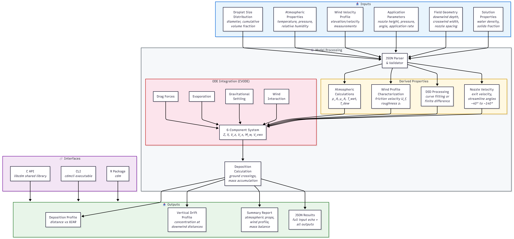

# Design Specification

**Document Version:** 1.0 | **Date:** October 30, 2025

> This page provides an overview. View the [full Design Specification on GitHub](https://github.com/SprayDriftModels/CDM/blob/main/docs/DesignSpecification.md).

## Purpose

The Design Specification provides technical implementation details for CDM developers and maintainers. It covers the software architecture, data structures, algorithms, and coding standards.

## System Architecture

```
┌─────────────────────────────────────────────────────┐
│              Client Applications                    │
│          (CLI, R Package, Custom)                   │
├─────────────────────────────────────────────────────┤
│                   C API Layer                       │
│              (CDM.h / CDM.cpp)                      │
├─────────────────────────────────────────────────────┤
│              Model Orchestration                    │
│                 (Model.hpp)                         │
├──────────┬──────────┬──────────┬────────────────────┤
│ Atmos.   │ Wind     │ Droplet  │ Transport /        │
│ Props    │ Profile  │ Size     │ Deposition         │
├──────────┴──────────┴──────────┴────────────────────┤
│           SUNDIALS / Ceres / Blaze                  │
└─────────────────────────────────────────────────────┘
```

## Model Component Diagram

The following diagram shows how inputs flow through the model processing pipeline to produce outputs, and how the different interfaces connect to the system.



## Module Design

### Source Files

| File | Purpose |
|------|---------|
| `CDM.cpp` | C API implementation |
| `CDMCLI.cpp` | Command-line interface |
| `Model.hpp` | Model orchestration and state |
| `AtmosphericProperties.cpp/hpp` | Atmospheric property calculations |
| `WindVelocityProfile.cpp/hpp` | Wind profile characterization |
| `DropletSizeModel.cpp/hpp` | Droplet size distribution processing |
| `DropletTransport.cpp/hpp` | ODE-based droplet transport |
| `NozzleVelocity.cpp/hpp` | Nozzle exit velocity calculations |
| `Deposition.cpp/hpp` | Deposition accumulation and reporting |
| `Serialization.cpp/hpp` | JSON input/output |
| `CVodeIntegrator.hpp` | CVODE wrapper with RAII |
| `Interpolate1D.hpp` | 1D interpolation utilities |
| `Constants.hpp` | Physical constants |
| `CVodeError.hpp` | CVODE error handling |

### Key Design Decisions

- **C API with C++ internals**: Public API uses C for maximum interoperability; implementation is modern C++17
- **RAII throughout**: All resources managed via smart pointers and RAII wrappers
- **Header-only templates**: `Model.hpp`, `CVodeIntegrator.hpp`, `Interpolate1D.hpp` are header-only
- **Opaque pointer pattern**: `cdm_model_t` hides C++ implementation from C clients

## Algorithm Design

### ODE Integration

- **Solver**: SUNDIALS CVODE with BDF method
- **Tolerances**: Relative 1×10⁻⁴; component-specific absolute tolerances
- **Root finding**: Used to detect ground-level crossings
- **Right-hand side**: Computes drag forces, gravitational settling, evaporation, and wind interaction

### Droplet Size Distribution

- **Curve fitting**: Ceres Solver performs non-linear least squares fit to CDF
- **Parameterization**: Log-normal or similar distribution models
- **Discretization**: Distribution divided into size classes for transport integration

### Wind Profile

- **Logarithmic law**: Wind velocity follows log-law profile above canopy
- **Parameter estimation**: Friction velocity and roughness length from measurements
- **Optimization**: Ceres Solver for parameter fitting

## Build System

### CMake Configuration

- **Minimum CMake version**: 3.21
- **C++ standard**: C++17
- **Package manager**: vcpkg (with manifest mode)
- **Presets**: CMakePresets.json for common configurations

### Directory Structure

| Directory | Contents |
|-----------|----------|
| `include/cdm/` | Public C API header |
| `src/` | C++ implementation files |
| `tests/` | Test case JSON files |
| `R/cdm/` | R package source |
| `cmake/` | CMake helper scripts |
| `docs/` | Documentation |

## Code Quality Standards

- Modern C++17 idioms
- Consistent naming: snake_case for C API, CamelCase for C++ classes
- RAII for all resource management
- No raw `new`/`delete` in application code
- Comprehensive error handling via custom error handler
