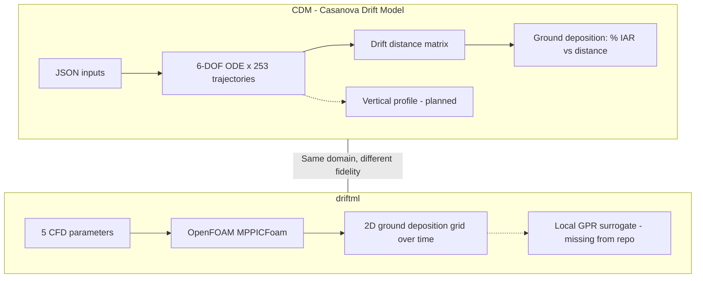

# driftml vs CDM: Usefulness Assessment

**Status:** Archived assessment (July 2026)  
**External repo:** [klotzd/driftml](https://github.com/klotzd/driftml) at `C:\Users\gbbfx\GitProjects\driftml`  
**Related CDM docs:** [vertical-profile-spec.md](vertical-profile-spec.md), [manuscript_model_description.md](manuscript_model_description.md)

---

## Scope decision

All four follow-up tracks from the assessment plan are pursued as **reference artifacts** in the CDM repository (no driftml code vendored):

| Option | Track | CDM deliverable | Integration into CDM core |
|--------|-------|-----------------|---------------------------|
| **A** | Archive assessment | This document | None |
| **B** | CFD validation cross-check | [driftml_setac_harmonization.md](driftml_setac_harmonization.md) | External OpenFOAM workflow only |
| **C** | Vertical profile reference | [scripts/openfoam_vertical_plane_extractor.py](../scripts/openfoam_vertical_plane_extractor.py) | Post-processing reference for spec §5–6 |
| **D** | Batch parameter sweeps | [scripts/batch_sweep/](../scripts/batch_sweep/) | Native `cdmcli` runner, no driftml dependency |

**Rationale:** driftml and CDM share the agricultural spray-drift domain but differ in fidelity, geometry, and maturity. CDM remains the regulatory mechanistic model; driftml is kept as an external CFD reference.

---

## Executive summary

**driftml is not a drop-in complement to CDM.** It is moderately useful as a reference for CFD benchmarking, vertical-profile research, and batch-sweep workflow patterns. It is not useful as a replacement engine, ML surrogate layer, or regulatory validation source.

Both projects model **agricultural spray drift** (pesticide droplet transport/deposition), not machine-learning concept/data drift.

---

## What driftml is

| Aspect | driftml | CDM |
|--------|---------|-----|
| **Purpose** | CFD training data + ML surrogates for spatial deposition | Regulatory mechanistic simulator for % IAR vs downwind distance |
| **Physics** | 3D E/L: k-ε turbulence, MPPIC collisions, cone injection, Rosin-RRammler DSD | 1D trajectory ODEs: Clift-Gauvin drag, Ranz-Marshall evaporation, log-law wind |
| **Inputs** | 5 scalars: theta, phi, U0, Uwind, alpha | Full atmospheric state, measured DSD, field geometry, canopy, nozzle pressure |
| **Output** | `(xgrid, zgrid, n_timesteps)` numpy tensors | `[distance_m, pctIAR]` curve + drift distance matrix |
| **Speed** | Hours per CFD case | Seconds per run |
| **Stack** | OpenFOAM 6/7/8, Nextflow, Python 3.8 | C++ (CVODE), R wrapper, Python validation |
| **Maturity** | Academic MWE; no license, no tests; ML notebooks/report missing | v1.2.0, AGPL, SETAC-validated |

---

## Usefulness by interest area

### CFD validation benchmark (moderate value, high effort)

Useful as an exploratory sanity check in simplified wind-tunnel geometry. Not regulatory-grade cross-validation. SETAC DRAW field validation remains authoritative. See harmonization guide for parameter mapping limits.

### Vertical drift profile support (moderate value, indirect)

OpenFOAM retains full 3D Lagrangian tracks. driftml only extracts **ground** deposition; vertical-plane extraction requires custom post-processing (see `scripts/openfoam_vertical_plane_extractor.py`).

### Batch-sweep infrastructure (low–moderate value)

The **workflow pattern** (LHS + CSV-driven batch runs) is more valuable than driftml code. Implemented natively in `scripts/batch_sweep/`.

### Not useful for CDM

- Local GPR surrogate (notebooks missing; CDM is already fast)
- Disinfection classifier (different application)
- Direct code import (OpenFOAM/Python vs C++/CVODE)

---

## Risk summary

| Risk | Severity |
|------|----------|
| driftml incomplete (missing notebooks/report) | High |
| No license on driftml | Medium |
| Geometry/physics mismatch with CDM | High |
| Script bugs in driftml | Medium |
| OpenFOAM dependency | Medium |

---

## Bottom line

| Question | Answer |
|----------|--------|
| Same problem domain? | Yes — agricultural spray drift |
| Direct code reuse? | No |
| Useful for CDM validation? | Marginally — wind-tunnel CFD only |
| Useful for vertical profiles? | Indirectly — 3D physics reference with custom extraction |
| Useful for batch sweeps? | Pattern only — implemented natively |
| Worth integrating into CDM repo? | No — external reference |
| Worth a one-off cross-check study? | Maybe — if OpenFOAM capacity exists |

**Recommended path:** Use native batch tooling (`scripts/batch_sweep/`) for sensitivity/UQ. Pursue CFD cross-check only with a defined harmonization protocol ([driftml_setac_harmonization.md](driftml_setac_harmonization.md)). Continue CDM vertical-profile work against [vertical-profile-spec.md](vertical-profile-spec.md).
