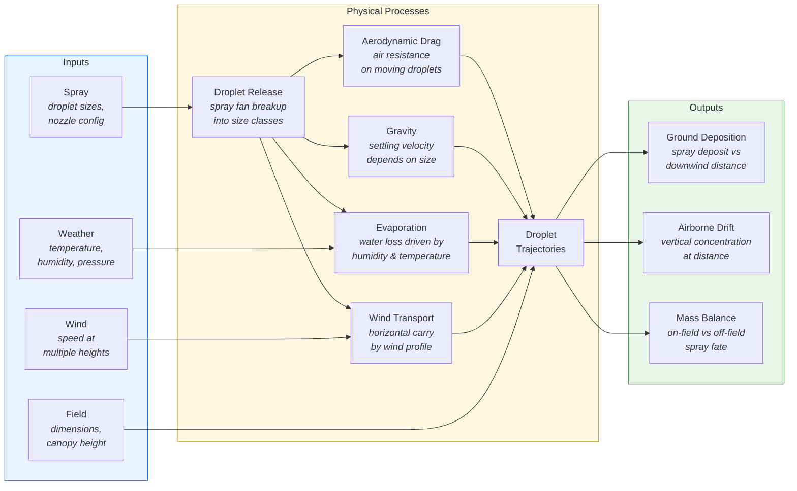

# Casanova Drift Model (CDM)

The Casanova Drift Model (CDM) is a mechanistic model that simulates the trajectory and fate of pesticide spray droplets released from agricultural spray equipment. The model predicts the transport and deposition of spray droplets under various atmospheric and application conditions.

<div class="feature-grid">
  <div class="feature-card">
    <h3>🔬 Mechanistic Simulation</h3>
    <p>Physics-based droplet transport using ODE integration with CVODE, accounting for drag, evaporation, and wind interactions.</p>
  </div>
  <div class="feature-card">
    <h3>📊 Deposition Profiles</h3>
    <p>Predicts ground deposition as a function of downwind distance, validated against SETAC DRAW test cases.</p>
  </div>
  <div class="feature-card">
    <h3>🌬️ Vertical Drift Profiles</h3>
    <p>Extracts vertical drift concentration profiles at specified downwind distances for non-target organism risk assessment.</p>
  </div>
  <div class="feature-card">
    <h3>🔗 Multiple Interfaces</h3>
    <p>C API shared library, command-line interface (CLI), and R package for flexible integration.</p>
  </div>
</div>

## Key Capabilities

- **Droplet Size Distribution**: Parameterized via non-linear least squares curve fitting
- **Atmospheric Modeling**: Temperature, pressure, humidity, wet bulb temperature depression
- **Wind Profile**: Characterized by friction velocity and friction height
- **Spray Fan Geometry**: Multiple streamline vectors spanning ejection angles from −40° to −140°
- **Evaporation**: Droplet evaporation modeled via wet bulb temperature depression calculations
- **Deposition**: Ground and canopy deposition accounting for size-dependent transport

## How It Works



## Test Cases

The model is validated against SETAC DRAW test cases:

| Case | Trial ID  | Nozzle Type | Nozzle Pressure    | Surfactant | Input File |
|------|-----------|-------------|--------------------|------------|------------|
| B    | FR_1_017  | AXI 11002   | 250 kPa (36 psig)  | None       | [Case_B.json](https://github.com/SprayDriftModels/CDM/blob/main/tests/Case_B.json) |
| G    | NL_1_660  | XR 11004    | 300 kPa (44 psig)  | Agral      | [Case_G.json](https://github.com/SprayDriftModels/CDM/blob/main/tests/Case_G.json) |
| I    | DE_4_006  | XR 11004    | 250 kPa (36 psig)  | None       | [Case_I.json](https://github.com/SprayDriftModels/CDM/blob/main/tests/Case_I.json) |

## Quick Start

### CLI

```bash
# Run model with a test case
cdmcli tests/Case_B.json

# Save JSON output
cdmcli tests/Case_B.json -o results.json
```

### C API

```c
#include <cdm/CDM.h>

cdm_model_t* model = cdm_create_model(json_config);
int status = cdm_run_model(model);
cdm_print_report(model);
char* output = cdm_get_output_string(model);
cdm_free_string(output);
cdm_free_model(model);
```

### R Package

```r
library(cdm)
result <- cdm_run("tests/Case_B.json")
demo("caseB", package = "cdm")
```

## Dependencies

CDM relies on high-quality scientific computing libraries, all managed through [vcpkg](https://github.com/microsoft/vcpkg):

- **[SUNDIALS](https://computing.llnl.gov/projects/sundials)** — ODE solver (CVODE)
- **[Ceres Solver](http://ceres-solver.org/)** — Non-linear least squares optimization
- **[Blaze](https://bitbucket.org/blaze-lib/blaze)** — Linear algebra and matrix operations
- **[Boost.Math](https://www.boost.org/doc/libs/release/libs/math/)** — Mathematical functions
- **[nlohmann/json](https://github.com/nlohmann/json)** — JSON parsing and serialization
- **[fmt](https://fmt.dev/)** — String formatting

## Version

**Current Version**: 1.2.0
