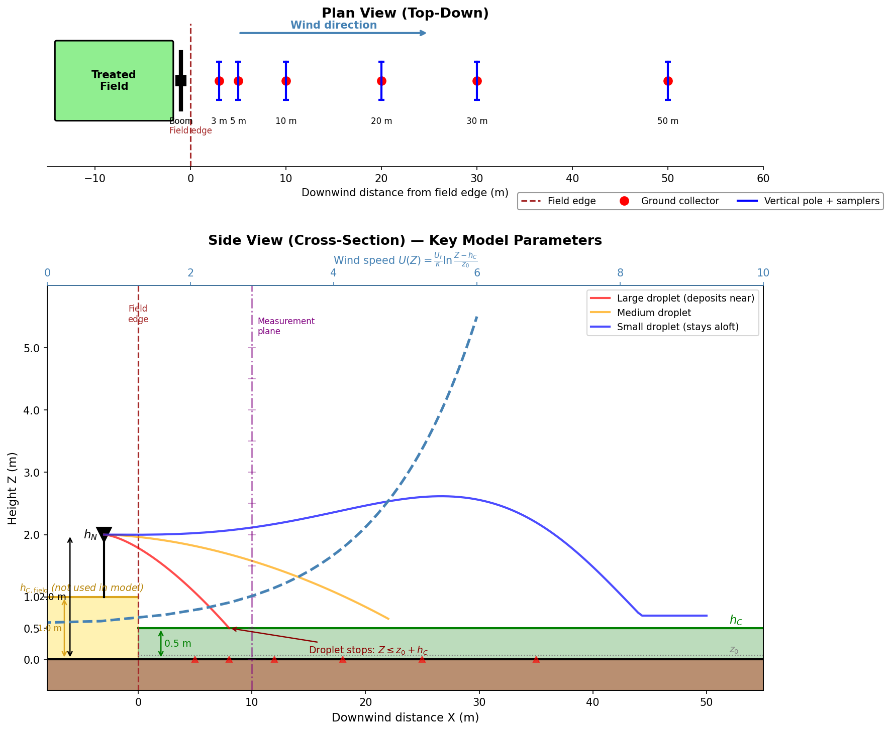

# CDM Parameter Reference

## Experiment Schematic



*Generated by [`docs/generate_schematic.py`](generate_schematic.py). The treated field canopy (gold, $h_{C,\text{field}}$) is shown for context but is **not used** by the model. The model uses only the downwind receptor surface canopy height (green, $h_C$) for the wind profile, displacement height, and stopping condition.*

### What is Measured

| Collector type | Location | Measures | Model output |
|----------------|----------|----------|--------------|
| Ground (horizontal) | Surface, at distances 3–50 m | Mass deposited per unit area | Ground deposition (% IAR) |
| Vertical pole | Heights 0–5 m, at fixed distances | Mass passing through height band | Vertical drift profile (% IAR per height bin) |

---

## State Variables (ODE System)

| Symbol | Code name | Units (ODE) | Definition |
|--------|-----------|-------------|------------|
| Z | `x[0]` | cm | Droplet height above ground |
| X | `x[1]` | cm | Droplet downwind distance from nozzle |
| V_z | `x[2]` / `Vz` | cm/s | Droplet vertical velocity |
| V_x | `x[3]` / `Vx` | cm/s | Droplet horizontal velocity |
| M_w | `x[4]` / `Mw` | g | Mass of water remaining in droplet |
| V_vwx | `x[5]` / `Vvwx` | cm/s | Local horizontal wind velocity at droplet height |

## Environmental / Input Parameters

| Symbol | Code name | Units (input) | Units (ODE) | Definition |
|--------|-----------|---------------|-------------|------------|
| z₀ | `z0` | m | cm | Roughness length (friction height), computed as z₀ = 0.00341 + 0.1245 · h_C |
| h_C | `hC` | m | cm | Canopy height of the **downwind receptor surface** (not the treated crop); defines displacement height and stopping condition. Nozzle height h_N must be above h_C. |
| h_N | `hN` | m | cm | Nozzle height above ground (adjusted by liquid sheet offset); always above h_C |
| U_f | `Uf` | m/s | cm/s | Friction velocity — characterises surface shear stress; derived from wind measurements and z₀ |
| κ | `constants::karman` | — | — | von Kármán constant (≈ 0.4); relates friction velocity to log-law wind profile |
| ψψψ | `psipsipsi` / `pppcalc` | — | — | Atmospheric stability correction factor; derived from Richardson number or entered directly |
| ΔT_wb | `dTwb` | °C | °C | Wet-bulb temperature depression — drives evaporation rate |

## Fluid / Material Properties

| Symbol | Code name | Units | Definition |
|--------|-----------|-------|------------|
| ρ_A | `rhoA` | g/cm³ | Density of wet air |
| μ_A | `muA` | g·cm⁻¹·s⁻¹ | Dynamic viscosity of wet air |
| ρ_W | `rhoW` | g/cm³ | Density of pure water in the droplet |
| ρ_S | `rhoS` | g/cm³ | Density of dissolved solids in the droplet |
| ρ_L | `rhoL` | g/cm³ | Density of the sprayed solution |

## Droplet Parameters

| Symbol | Code name | Units (input) | Units (ODE) | Definition |
|--------|-----------|---------------|-------------|------------|
| d_p | `dp` | μm | cm | Droplet diameter |
| M_s | `Ms0` | g | g | Mass of dissolved solids in the droplet (constant during transport) |
| x_s0 | `xs0` | fraction | fraction | Mass fraction of total dissolved solids in spray solution |
| V_t | `Vt` | — | cm/s | Terminal settling velocity of the droplet |

## Dimensionless / Derived Quantities

| Symbol | Code name | Definition |
|--------|-----------|------------|
| C_D | `CD(Re)` | Drag coefficient, function of Reynolds number |
| Re | — | Reynolds number: Re = ρ_A · D_D · \|V_rel\| / μ_A |
| δδδ | `ddd` | Scale factor for maximum deposition time (controls ODE integration duration) |

## Key Relationships

### Wind profile (log-law)

```
U(Z) = (U_f / κ) · ln((Z - h_C) / z₀)
```

Applied in the ODE as the derivative:

```
dVvwx/dt = Vz · (U_f / κ) / (Z - h_C)
```

### Initial wind velocity at nozzle height

```
Vvwx0 = (U_f / κ) · ln((h_N - h_C) / z₀)
```

### Stopping condition

Droplet deposits when:

```
Z ≤ z₀ + h_C
```

## Unit Conventions

- The model interface uses **SI units** (m, m/s, μm for droplet diameter)
- The ODE internally works in **CGS units** (cm, g, s)
- Conversions occur in `DropletTransport` constructor and `operator()`
