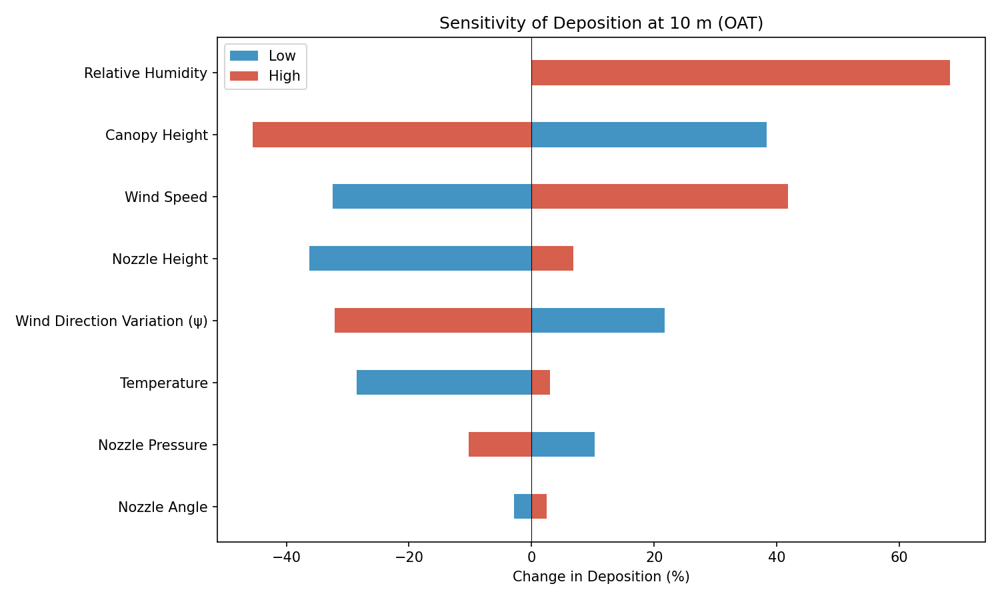
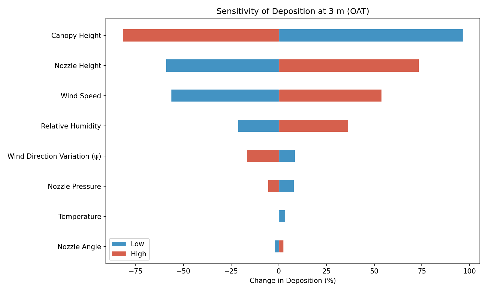
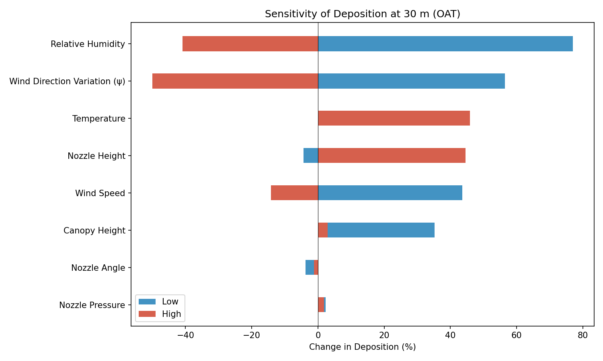
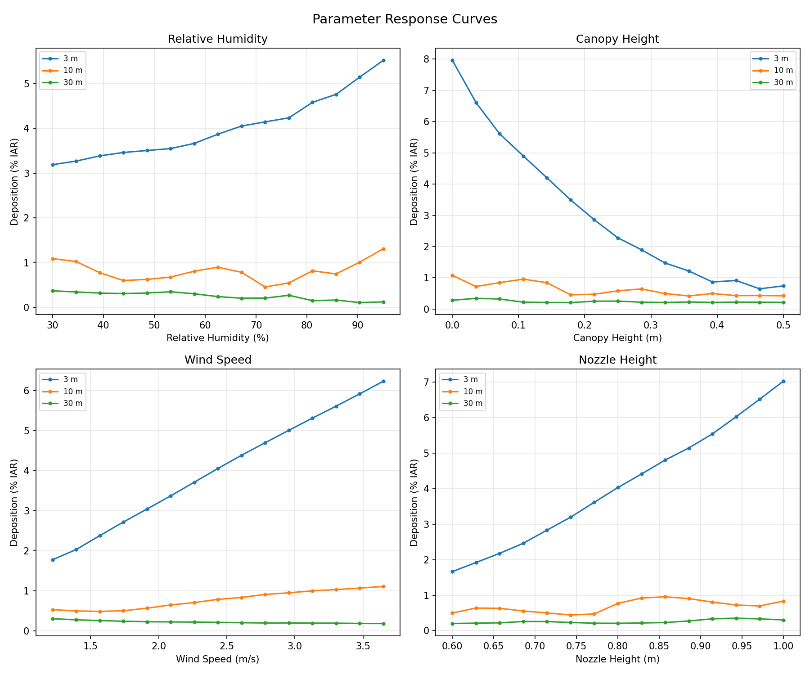
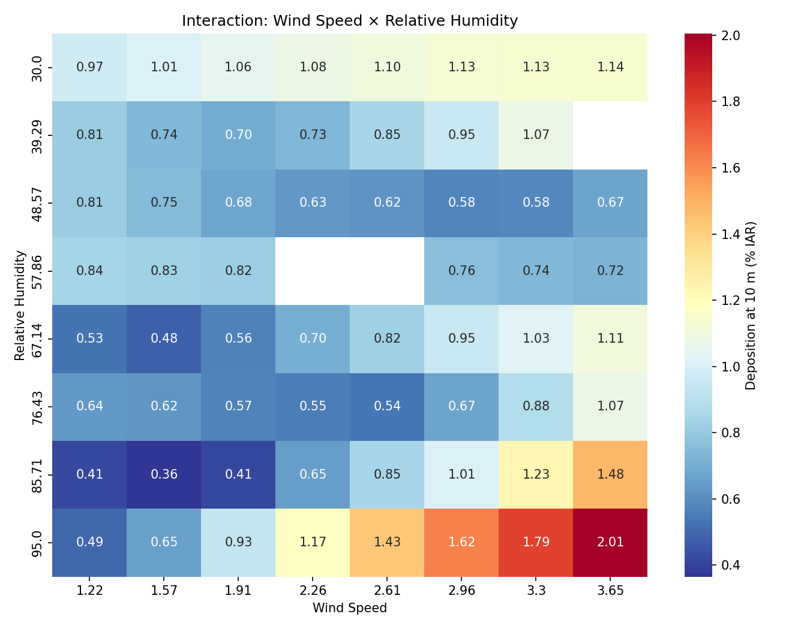
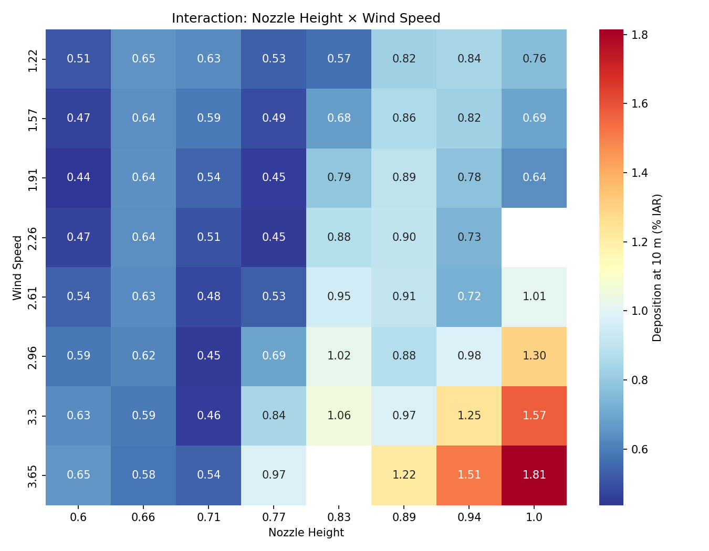

## Introduction

This document presents a sensitivity analysis of the Casanova Drift Model (CDM), version 1.2.0. The analysis quantifies how model outputs---specifically ground deposition expressed as a percentage of the intended application rate (%IAR)---respond to perturbations in key input parameters. Understanding parameter sensitivity is essential for (i) identifying the dominant physical drivers of spray drift, (ii) prioritising measurement effort in field trials, and (iii) establishing confidence bounds on model predictions used for regulatory risk assessment.

The analysis follows a three-stage approach:

1. **One-at-a-time (OAT) perturbation** to screen all parameters,
2. **Full parameter sweeps** for the most influential factors, and
3. **Two-factor interaction analysis** to examine combined effects.

All simulations use SETAC DRAW Case B (Trial FR_1_017, AXI 11002 nozzle at 250 kPa, no surfactant) as the baseline configuration.

## Methods

### Baseline Configuration

The baseline simulation uses the following input parameters from SETAC DRAW Case B:

| Parameter | Value | Unit |
|-----------|-------|------|
| Dry air temperature | 16.6 | °C |
| Barometric pressure | 101 325 | Pa |
| Relative humidity | 67.1 | % |
| Wind speed (at 2 m) | 2.44 | m/s |
| Horizontal wind variation (ψ) | 10.7 | ° |
| Nozzle height | 0.80 | m |
| Canopy height | 0.15 | m |
| Nozzle pressure | 250 000 | Pa |
| Nozzle angle | 110 | ° |
| Application rate | 0.839 | kg/ha |
| Downwind field depth | 24.0 | m |

### Parameters Varied

Eight input parameters were selected for the sensitivity analysis based on their physical relevance to droplet transport and deposition:

| Parameter | Baseline | Low | High | Rationale |
|-----------|----------|-----|------|-----------|
| Wind speed | 2.44 m/s | 1.22 m/s | 3.65 m/s | Primary driver of horizontal transport |
| Nozzle height | 0.80 m | 0.60 m | 1.00 m | Determines fall time and drift exposure |
| Nozzle pressure | 250 kPa | 150 kPa | 350 kPa | Affects exit velocity |
| Nozzle angle | 110° | 90° | 130° | Controls initial trajectory direction |
| Temperature | 16.6 °C | 6.6 °C | 26.6 °C | Affects evaporation rate |
| Relative humidity | 67.1% | 30% | 95% | Affects evaporation rate |
| Canopy height | 0.15 m | 0.0 m | 0.50 m | Shortens effective fall distance |
| Wind direction variation (ψ) | 10.7° | 0° | 25° | Lateral spreading of spray plume |

### Output Metrics

Deposition was evaluated at three downwind distances representing near-field, mid-field, and far-field drift:

- **3 m** — near-field drift (close to field edge)
- **10 m** — mid-field, commonly used as a regulatory reference distance
- **30 m** — far-field drift

Additionally, **total off-field deposition** was computed by trapezoidal integration of the deposition profile beyond the 24 m field edge.

### Analysis Procedures

**OAT analysis.** Each parameter was set to its low and high value while all others remained at baseline. The percentage change in deposition relative to the baseline was computed at each evaluation distance.

**Parameter sweeps.** The four most influential parameters (identified from OAT) were varied across 15 equally spaced values spanning their full range. Deposition was recorded at all three distances.

**Two-factor interactions.** Two parameter pairs were evaluated on an 8 × 8 grid: (i) wind speed × relative humidity and (ii) nozzle height × wind speed. Deposition at 10 m was recorded for each combination.

## Results

### OAT Sensitivity Ranking

The OAT analysis identified the following parameter ranking by maximum absolute percentage change in deposition at 10 m downwind (@tbl-ranking):

| Rank | Parameter | Max \|% Change\| at 10 m |
|------|-----------|--------------------------|
| 1 | Relative humidity | 68.3% |
| 2 | Canopy height | 45.5% |
| 3 | Wind speed | 41.8% |
| 4 | Nozzle height | 36.3% |
| 5 | Wind direction variation (ψ) | 32.2% |
| 6 | Temperature | 28.5% |
| 7 | Nozzle pressure | 10.3% |
| 8 | Nozzle angle | 2.8% |

: Parameter sensitivity ranking at 10 m downwind distance {#tbl-ranking}

The tornado diagram at 10 m (@fig-tornado) illustrates the asymmetric response of deposition to low and high perturbations for each parameter.

{#fig-tornado}

### Tornado Diagrams at Additional Distances

The sensitivity structure shifts with distance. At 3 m (@fig-tornado-3m), wind speed dominates because near-field deposition is highly dependent on horizontal transport velocity. At 30 m (@fig-tornado-30m), relative humidity and wind direction variation become more prominent as evaporation and lateral spreading have more time to act on the smaller, slower-settling droplets that reach far-field distances.

::: {layout-ncol=2}
{#fig-tornado-3m}

{#fig-tornado-30m}
:::

### Parameter Response Curves

Full sweeps of the top four parameters (@fig-response) reveal nonlinear relationships between inputs and deposition:

{#fig-response}

Key observations:

- **Relative humidity**: Deposition increases with humidity across all distances. Lower humidity increases evaporation, reducing droplet size and mass, which causes smaller droplets to remain airborne longer. Higher humidity preserves droplet mass, leading to higher deposition at all distances. The relationship is approximately linear at 10 m and 30 m.
- **Canopy height**: Increasing canopy height reduces the effective fall distance, resulting in a steep decline in deposition. The effect is most pronounced at mid-field and far-field distances.
- **Wind speed**: Higher wind speed increases deposition at near-field distances (3 m) but the relationship is complex at far-field distances, where increased transport can carry droplets beyond the measurement point.
- **Nozzle height**: Higher nozzle position increases drift exposure time, leading to greater deposition at all distances. The response is approximately linear.

### Two-Factor Interactions

#### Wind Speed × Relative Humidity

The interaction heatmap (@fig-int-wind-rh) shows that deposition at 10 m is highest under high wind speed combined with high relative humidity. Low humidity partially offsets the effect of high wind speed through enhanced evaporation.

{#fig-int-wind-rh}

#### Nozzle Height × Wind Speed

The nozzle height × wind speed interaction (@fig-int-height-wind) confirms that both parameters act synergistically: higher nozzle position combined with higher wind speed produces the greatest mid-field deposition, while the lowest deposition occurs at low nozzle height and low wind speed.

{#fig-int-height-wind}

## Discussion

### Dominant Parameters

The sensitivity analysis reveals that **evaporation-related parameters** (relative humidity, temperature) and **geometric parameters** (canopy height, nozzle height) exert the strongest influence on predicted deposition. This is physically consistent: evaporation governs the rate at which droplets lose mass and shrink, directly affecting settling velocity and airborne residence time. Geometric parameters determine the available fall distance and hence the time window during which atmospheric forces act on the droplets.

**Wind speed** is the primary driver at near-field distances but its influence is more complex at far-field distances, where it can transport droplets beyond the evaluation point. **Nozzle angle** and **nozzle pressure** have comparatively minor effects, suggesting that these operational parameters are less critical for drift prediction accuracy than environmental conditions.

### Model Limitations Identified

During the analysis, the model failed to converge at the high temperature extreme (26.6 °C) due to ODE solver step limits being exceeded. This occurs because rapid evaporation at high temperature and moderate humidity creates stiff differential equations as droplet mass approaches zero. This represents a practical limitation for simulations under hot, dry conditions and may warrant investigation of adaptive solver parameters or regularisation of the evaporation equations.

### Implications for Field Measurements

The results suggest that accurate measurement of **relative humidity** and **wind speed** are the most critical meteorological inputs for reliable drift predictions. Field trial protocols should prioritise:

1. Continuous humidity monitoring at boom height
2. Wind speed profiling at multiple elevations
3. Accurate measurement of boom (nozzle) height above the canopy

Nozzle pressure and angle, while important for spray quality, have relatively minor effects on predicted drift deposition compared to environmental conditions.

### Implications for Regulatory Assessment

For regulatory risk assessments, the strong sensitivity to relative humidity suggests that drift predictions should be evaluated across a range of humidity conditions rather than at a single reference value. The interaction between wind speed and humidity indicates that worst-case scenarios for drift exposure involve high wind speed combined with high humidity (which preserves droplet mass during transport).

## Conclusions

1. **Relative humidity** is the single most influential parameter for mid-field drift deposition, with a 68% change in deposition at 10 m across the tested range.
2. **Canopy height**, **wind speed**, and **nozzle height** are the next most influential parameters, each producing 36--46% changes in deposition.
3. **Nozzle angle** has minimal effect on drift deposition (< 3% change), confirming that spray geometry has limited influence compared to environmental conditions.
4. Two-factor interactions between wind speed and humidity, and between nozzle height and wind speed, are significant and should be considered in scenario-based assessments.
5. The model exhibits convergence limitations under extreme evaporation conditions (high temperature, moderate humidity) that should be documented as a boundary condition for model applicability.

## Reproducibility

All simulations were performed using CDM version 1.2.0 on Windows. The analysis script (`sensitivity/run_sensitivity.py`) and all results are available in the `publication` branch of the [CDM repository](https://github.com/SprayDriftModels/CDM/tree/publication/sensitivity).

To reproduce the analysis:

```bash
git clone -b publication https://github.com/SprayDriftModels/CDM.git
cd CDM
pip install polars seaborn matplotlib pyarrow
python sensitivity/run_sensitivity.py
```

## References

::: {#refs}
:::
